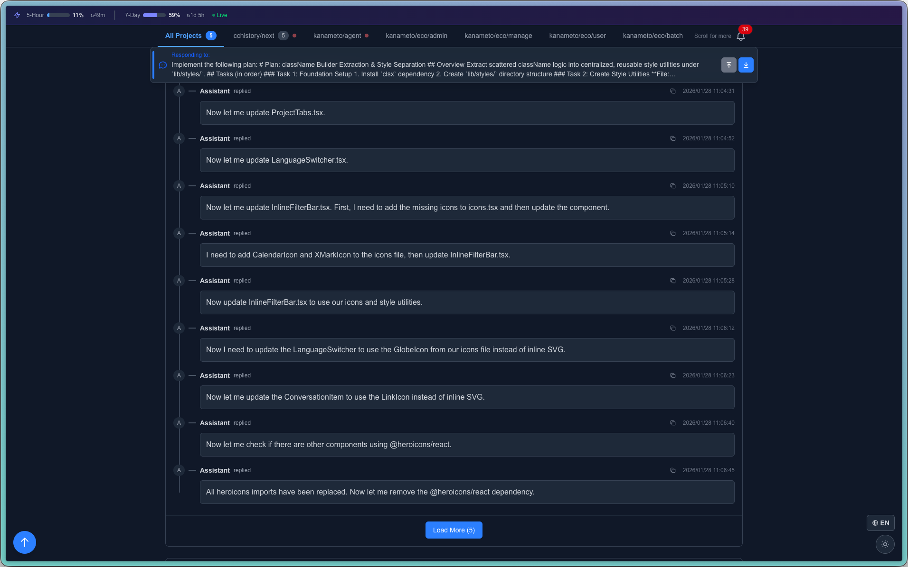

# Claude Conversations History Viewer

Claude Code の会話履歴を閲覧・検索するためのモダンなWebアプリケーションです。

[](https://opensource.org/licenses/MIT)
[](https://www.docker.com/)
[](https://nextjs.org/)
[](https://react.dev/)
[](https://fastapi.tiangolo.com/)

## 特徴

- 🚀 **軽量で高速** - Docker化されたマイクロサービス構成
- 📱 **レスポンシブデザイン** - モダンなUIで快適な閲覧体験
- 🔍 **柔軟な検索** - 日付・プロジェクト・キーワードでフィルタリング
- ⚡ **リアルタイム更新** - WebSocketによる自動更新
- 🎯 **マルチプロジェクト対応** - 複数のClaude Projectsを統合表示
- 🔔 **Claude Code Hooks連携** - Claude Code hooksからのリアルタイム通知
- 📊 **トークン使用量表示** - セッション・週間の使用量を監視
- 🔧 **設定可能** - 環境変数による柔軟な設定

## スクリーンショット



*会話履歴と検索・フィルター機能を備えたメインインターフェース*

## 必要要件

- Docker & Docker Compose
- Claude Code CLI（`~/.claude/projects`にデータが存在する）

## クイックスタート

### 1. リポジトリのクローン

```bash
git clone https://github.com/masanao-ohba/cchistory.git
cd cchistory
```

### 2. 環境設定

```bash
# 設定ファイルをコピー
cp .env.example .env

# 必要に応じて設定を編集
vim .env
```

### 3. 起動

```bash
# Docker Composeで起動
docker-compose up -d

# ログを確認
docker-compose logs -f
```

### 4. アクセス

ブラウザで http://localhost:18080 にアクセス

## Claude Code Hooks連携

このアプリケーションは、Claude Code hooksからのリアルタイム通知を受信し、複数のプロジェクトのClaude Code活動を監視できます。

### Hooksの設定

1. **プロジェクトにhooksをインストール**（cchistoryディレクトリから実行）：
   ```bash
   # cchistoryディレクトリに移動
   cd /path/to/cchistory

   # 対象プロジェクトのパスを指定してhooks インストーラを実行
   ./scripts/install-hooks.sh --target-project-path /path/to/your/claude/project
   ```

2. **自動セットアップ** - スクリプトが以下を実行します：
   - このプロジェクトの`.env`ファイルからポート設定を読み取り
   - Webhook URLを自動設定
   - 対象プロジェクトの`.claude/settings.local.json`にhooksをインストール

3. **Claude Codeを再起動**して変更を適用

### 高度なHook設定

```bash
# 基本的な使用方法
./scripts/install-hooks.sh --target-project-path ~/myproject

# カスタム通知受信プロジェクトのパスを指定
./scripts/install-hooks.sh --target-project-path ~/myproject --notification-receiver-path ~/cchistory

# カスタムポートを使用
./scripts/install-hooks.sh --target-project-path ~/myproject --port 8080

# 変更を適用せずにプレビュー
./scripts/install-hooks.sh --target-project-path ~/myproject --dry-run

# ヘルプを表示
./scripts/install-hooks.sh --help
```

### サポートされる通知タイプ

- **権限要求** - Claude Codeが権限を要求するとき
- **ツール使用** - Claude Codeがファイル操作などのツールを使用するとき
- **一般通知** - その他のClaude Code活動

### 通知の表示

- 右上の通知ベルアイコンをクリック
- リアルタイム通知がすぐに表示される
- 通知を既読/未読にマーク
- 個別通知を削除
- 全通知を既読にマーク

## 設定

### 環境変数

| 変数名 | デフォルト値 | 説明 |
|--------|-------------|------|
| `VIEWER_PORT` | `18080` | アプリケーションのポート |
| `CLAUDE_PROJECTS_PATH` | `~/.claude/projects` | Claude projectsのパス |
| `CLAUDE_PROJECTS` | - | 特定プロジェクトのパス（カンマ区切りまたはJSON配列） |
| `TIMEZONE` | `Asia/Tokyo` | タイムゾーン |
| `LOG_LEVEL` | `INFO` | ログレベル |
| `NGROK_AUTHTOKEN` | - | ngrok認証トークン |
| `NGROK_DOMAIN` | - | ngrokドメイン名 |
| `NGROK_OAUTH_ALLOW_EMAIL` | - | OAuth許可メールアドレス |
| `NGROK_OAUTH_ALLOW_DOMAIN` | - | OAuth許可メールドメイン |

### ngrokによる公開とOAuth認証

ngrokを使用してアプリケーションをインターネットに公開し、Google OAuth認証で保護できます：

1. **ngrok認証情報を取得**: [ngrok.com](https://ngrok.com)でサインアップし、authtokenとdomainを取得
2. **`.env`を設定**:
   ```bash
   NGROK_AUTHTOKEN=your_authtoken_here
   NGROK_DOMAIN=your-domain.ngrok-free.app
   NGROK_OAUTH_ALLOW_EMAIL=your-email@gmail.com
   NGROK_OAUTH_ALLOW_DOMAIN=your-company.com
   ```
3. **ngrokを含めて起動**: `docker-compose up -d`
4. **アクセス**: ngrokドメインにアクセス（例: `https://your-domain.ngrok-free.app`）

ユーザーはGoogleで認証するよう求められ、許可されたメールアドレス/ドメインのみアプリケーションにアクセスできます。

### ポートの変更

他のサービスとポートが競合する場合：

```bash
# .envファイルを編集
echo "VIEWER_PORT=19080" >> .env

# 再起動
docker-compose down
docker-compose up -d
```

## 使用方法

### 基本操作

1. **全件表示**: 初期状態では全ての会話が表示されます
2. **日付フィルター**: 開始日・終了日を指定して期間検索
3. **プロジェクトフィルター**: 特定のプロジェクトのみ表示
4. **キーワード検索**: 会話内容を検索
5. **クイックフィルター**: 今日、昨日、過去7日、過去30日の便利ボタン
6. **通知機能**: ベルアイコンからClaude Code hooksのリアルタイム通知を確認

### リアルタイム更新

- WebSocketにより、新しい会話が自動的に反映されます
- 画面右下のインジケーターで接続状態を確認できます

### パフォーマンス

- 大量のデータに対応するため、ページング機能を実装
- 初回表示は100件、「もっと読み込む」で追加取得
- ファイル変更の監視とキャッシュ機能により高速動作

## アーキテクチャ

**Docker Container:**
```
├── Nginx (Port 80)
│   ├── リバースプロキシ
│   └── 静的ファイル配信
├── Next.js Frontend (Port 3000)
│   ├── React 19 with App Router
│   ├── TanStack React Query
│   ├── Zustand State Management
│   └── Tailwind CSS v4
└── FastAPI Backend (Port 8000)
    ├── REST API
    ├── WebSocket
    └── ファイル監視
```

**↑ Volume Mount (Read-Only)**

**Host: ~/.claude/projects/**
```
├── project1/
│   ├── session1.jsonl
│   └── session2.jsonl
└── project2/
    └── session3.jsonl
```

### 技術スタック

**バックエンド:**
- FastAPI (高性能Python Webフレームワーク)
- uvicorn (ASGIサーバー)
- watchdog (ファイル監視)
- WebSocket (リアルタイム通信)
- Pydantic (データ検証)

**フロントエンド:**
- Next.js 15 (App Router搭載Reactフレームワーク)
- React 19 (UIライブラリ)
- TypeScript 5 (型安全JavaScript)
- TanStack React Query v5 (サーバー状態管理)
- Zustand (クライアント状態管理)
- Tailwind CSS v4 (ユーティリティファーストCSS)
- next-intl (国際化)

**インフラ:**
- Docker & Docker Compose
- Nginx (リバースプロキシ)
- Alpine Linux (軽量コンテナイメージ)

## API仕様

### エンドポイント

#### GET `/api/conversations`

会話履歴を取得

**パラメータ:**
- `start_date` (optional): 開始日 (YYYY-MM-DD)
- `end_date` (optional): 終了日 (YYYY-MM-DD)
- `project[]` (optional): プロジェクトID（複数指定可）
- `keyword` (optional): 検索キーワード
- `offset` (optional): オフセット (default: 0)
- `limit` (optional): 取得件数 (default: 100, max: 1000)

#### GET `/api/projects`

利用可能なプロジェクト一覧を取得

#### GET `/api/token-usage`

セッション・週間のトークン使用量統計を取得

#### POST `/api/notifications/hook`

Claude Code hooksからの通知を受信（webhook エンドポイント）

#### GET `/api/notifications`

通知履歴を取得

#### WebSocket `/ws/updates`

会話と通知のリアルタイム更新を受信

## トラブルシューティング

### よくある問題

#### 1. ポートが使用中

```bash
# ポートを変更
echo "VIEWER_PORT=19080" >> .env
docker-compose down
docker-compose up -d
```

#### 2. Claude Projectsが見つからない

```bash
# パスを確認
ls -la ~/.claude/projects

# カスタムパスを設定
echo "CLAUDE_PROJECTS_PATH=/path/to/claude/projects" >> .env
```

#### 3. データが表示されない

```bash
# ログを確認
docker-compose logs backend

# コンテナの状態確認
docker-compose ps
```

#### 4. Claude Code Hooksが動作しない

```bash
# hooksが正しくインストールされているか確認
cat .claude/settings.local.json

# webhook URLにアクセス可能か確認
curl -X POST http://localhost:18080/api/notifications/hook \
  -H "Content-Type: application/json" \
  -d '{"type":"test","project_id":"test","notification":"test","timestamp":"2024-01-01T00:00:00Z"}'

# 通知ログを確認
docker-compose logs -f backend | grep notification
```

### ログの確認

```bash
# 全サービスのログ
docker-compose logs -f

# 特定サービスのログ
docker-compose logs -f backend
docker-compose logs -f frontend-nextjs
docker-compose logs -f nginx
```

## 開発

### 開発環境のセットアップ

```bash
# ホットリロードで起動
docker-compose up --build

# フロントエンド開発
cd frontend-nextjs
npm install
npm run dev  # Next.js with Turbopackをポート3000で起動

# バックエンド開発
cd backend
python -m venv venv
source venv/bin/activate
pip install -r requirements.txt
uvicorn main:app --reload
```

### 貢献方法

1. Forkして開発用ブランチを作成
2. 変更を実装
3. テストを実行
4. Pull Requestを作成

## ライセンス

MIT License

## 作者

Masanao Ohba

## サポート

問題や質問がある場合：
- [GitHub Issues](https://github.com/masanao-ohba/cchistory/issues)でIssueを作成
