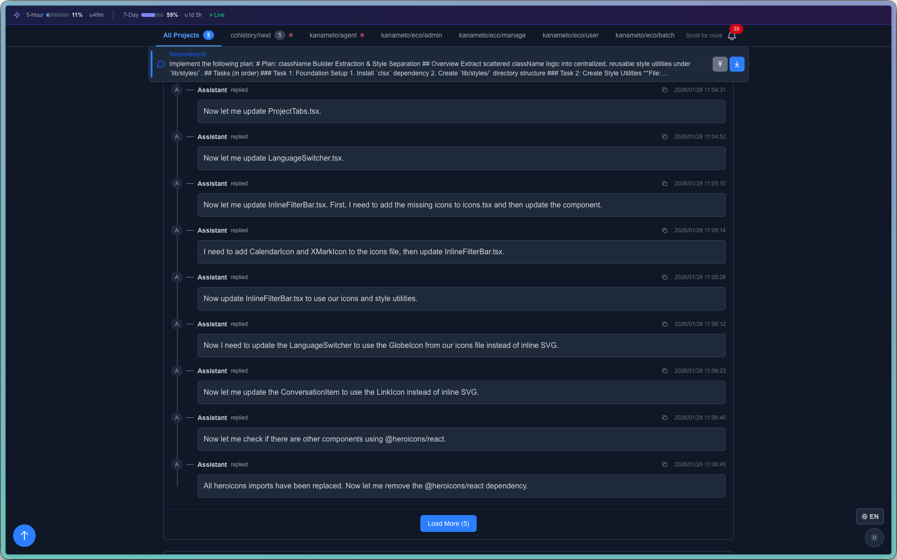

# Claude Conversations History Viewer

[](https://opensource.org/licenses/MIT)
[](https://www.docker.com/)
[](https://nextjs.org/)
[](https://react.dev/)
[](https://fastapi.tiangolo.com/)

Claude Codeの会話履歴をリアルタイム同期で閲覧・検索できるWebビューアー。マルチプロジェクト対応、強力なフィルタリング機能搭載。



*ダークモードのメインインターフェース - 会話履歴と検索・フィルター機能*

## 目次

- [クイックスタート](#クイックスタート)
- [特徴](#特徴)
- [アーキテクチャ](#アーキテクチャ)
- [設定](#設定)
- [Claude Code Hooks連携](#claude-code-hooks連携)
- [トークン使用量機能](#トークン使用量機能)
- [API仕様](#api仕様)
- [トラブルシューティング](#トラブルシューティング)
- [開発](#開発)
- [ライセンス](#ライセンス)

## クイックスタート

```bash
# 1. リポジトリをクローン
git clone https://github.com/masanao-ohba/cchistory.git && cd cchistory

# 2. 環境設定をコピー
cp .env.example .env

# 3. 起動
./start.sh
```

ブラウザで http://localhost:18080 にアクセス

## 特徴

- **軽量で高速** - Docker化されたマイクロサービス構成、Turbopackによる即座のホットリロード
- **レスポンシブデザイン** - Tailwind CSS v4によるモダンなUIで快適な閲覧体験
- **ダーク/ライトモード** - システム設定に連動するテーマ切り替え（右下のトグルで切り替え）
- **多言語対応** - 英語、日本語、中国語、韓国語の完全な国際化
- **柔軟な検索** - 日付・プロジェクト・キーワードでフィルタリング、クイックフィルターボタン
- **リアルタイム更新** - WebSocketによる自動更新、ストリーミングServer Components
- **マルチプロジェクト対応** - 複数のClaude Projectsをタブで統合表示
- **Claude Code Hooks連携** - Claude Code hooksからのリアルタイム通知
- **トークン使用量表示** - OAuth API連携でセッション・週間の使用量を監視
- **設定可能** - 環境変数による柔軟な設定

## アーキテクチャ

**Docker Container構成:**
```
                        +-----------------------+
                        |    Nginx (Port 80)    |
                        |  - リバースプロキシ   |
                        |  - 静的ファイル配信   |
                        +-----------+-----------+
                                    |
              +---------------------+---------------------+
              |                                           |
+-------------v-------------+             +---------------v---------------+
|  Next.js Frontend (3000)  |             |   FastAPI Backend (8000)      |
|  - React 19 + App Router  |             |   - REST API                  |
|  - TanStack React Query   |             |   - WebSocket                 |
|  - Zustand State          |             |   - ファイル監視              |
|  - Tailwind CSS v4        |             +---------------+---------------+
+---------------------------+                             |
                                                          | Volume Mount
                                                          | (Read-Only)
                                                          v
                                          +-------------------------------+
                                          |   Host: ~/.claude/projects/   |
                                          |   - project1/session1.jsonl   |
                                          |   - project2/session2.jsonl   |
                                          +-------------------------------+
```

<details>
<summary><strong>技術スタック</strong></summary>

**フロントエンド:**
- Next.js 15.5 with Turbopack (App Router、Server Components、Suspenseストリーミング搭載Reactフレームワーク)
- React 19.1 (最新のconcurrent features搭載React)
- TypeScript 5 (型安全JavaScript)
- Tailwind CSS v4 (モダンなユーティリティファーストCSSフレームワーク)
- TanStack React Query v5 (サーバー状態管理)
- Zustand (クライアント状態管理)
- next-intl (国際化 - EN, JA, ZH, KO)

**バックエンド:**
- FastAPI (高性能Python Webフレームワーク)
- uvicorn (ASGIサーバー)
- watchdog (ファイル監視)
- WebSocket (リアルタイム通信)
- Pydantic (データ検証)

**インフラ:**
- Docker & Docker Compose
- Nginx (リバースプロキシ)
- Alpine Linux (軽量コンテナイメージ)

</details>

## 設定

### 必要要件

- Docker & Docker Compose
- Claude Code CLI（`~/.claude/projects`にデータが存在する）

### 環境変数

| 変数名 | デフォルト値 | 説明 |
|--------|-------------|------|
| `VIEWER_PORT` | `18080` | アプリケーションのポート |
| `CLAUDE_PROJECTS_PATH` | `~/.claude/projects` | Claude projectsのパス |
| `CLAUDE_PROJECTS` | - | 特定プロジェクトのパス（カンマ区切りまたはJSON配列） |
| `TIMEZONE` | `Asia/Tokyo` | タイムゾーン |
| `LOG_LEVEL` | `INFO` | ログレベル |

### ポートの変更

```bash
echo "VIEWER_PORT=19080" >> .env
./start.sh stop && ./start.sh
```

<details>
<summary><strong>ngrokによる公開とOAuth認証</strong></summary>

ngrokを使用してアプリケーションをインターネットに公開し、Google OAuth認証で保護できます：

| 変数名 | 説明 |
|--------|------|
| `NGROK_AUTHTOKEN` | ngrok認証トークン |
| `NGROK_DOMAIN` | ngrokドメイン名 |
| `NGROK_OAUTH_ALLOW_EMAIL` | OAuth許可メールアドレス |
| `NGROK_OAUTH_ALLOW_DOMAIN` | OAuth許可メールドメイン |

**設定手順:**

1. **ngrok認証情報を取得**: [ngrok.com](https://ngrok.com)でサインアップし、authtokenとdomainを取得
2. **`.env`を設定**:
   ```bash
   NGROK_AUTHTOKEN=your_authtoken_here
   NGROK_DOMAIN=your-domain.ngrok-free.app
   NGROK_OAUTH_ALLOW_EMAIL=your-email@gmail.com
   NGROK_OAUTH_ALLOW_DOMAIN=your-company.com
   ```
3. **ngrokを含めて起動**: `./start.sh`
4. **アクセス**: ngrokドメインにアクセス（例: `https://your-domain.ngrok-free.app`）

ユーザーはGoogleで認証するよう求められ、許可されたメールアドレス/ドメインのみアプリケーションにアクセスできます。

</details>

## Claude Code Hooks連携

このアプリケーションは、Claude Code hooksからのリアルタイム通知を受信し、複数のプロジェクトのClaude Code活動を監視できます。

### Hooksの設定

```bash
# プロジェクトにhooksをインストール
./scripts/install-hooks.sh --target-project-path /path/to/your/project

# 変更を適用せずにプレビュー
./scripts/install-hooks.sh --target-project-path ~/myproject --dry-run
```

スクリプトは`.env`ファイルからポート設定を読み取り、Webhook URLを自動設定します。

### サポートされる通知タイプ

- **権限要求** - Claude Codeが権限を要求するとき
- **ツール使用** - Claude Codeがファイル操作などのツールを使用するとき
- **一般通知** - その他のClaude Code活動

### 通知の表示

右上の通知ベルアイコンをクリックして、リアルタイム通知を確認できます。通知を既読/未読にマークしたり、個別に削除できます。

<details>
<summary><strong>高度なHook設定</strong></summary>

```bash
# 基本的な使用方法
./scripts/install-hooks.sh --target-project-path ~/myproject

# カスタム通知受信プロジェクトのパスを指定
./scripts/install-hooks.sh --target-project-path ~/myproject --notification-receiver-path ~/cchistory

# カスタムポートを使用
./scripts/install-hooks.sh --target-project-path ~/myproject --port 8080

# 変更を適用せずにプレビュー
./scripts/install-hooks.sh --target-project-path ~/myproject --dry-run

# ヘルプを表示
./scripts/install-hooks.sh --help
```

</details>

## トークン使用量機能

このアプリケーションは、Anthropic APIからのリアルタイムトークン使用量を表示し、公式Claude Codeステータスと同様のセッション・週間リミットを表示します。

### データソース

1. **Anthropic API**（優先）: OAuthトークン経由でリアルタイムデータを取得
2. **ローカルJSONLファイル**（フォールバック）: 会話履歴から推定した使用量

### OAuthトークンリフレッシュ（macOSのみ）

`start.sh`スクリプトがポート18081で軽量HTTPサーバーを起動し、macOS KeychainからOAuthトークンを抽出します。トークンが期限切れの場合、トークン使用量パネルの「更新」ボタンをクリックしてください。

```bash
# トークンを手動でリフレッシュ
./scripts/refresh-oauth-token.sh

# トークンリフレッシュサーバーの状態を確認
curl http://localhost:18081/refresh
```

<details>
<summary><strong>macOS以外での使用</strong></summary>

Linux/Windowsでは、アプリケーションはローカルJSONL推定にフォールバックします。Anthropic APIデータを使用するには：

```bash
# 環境変数でトークンを設定
export ANTHROPIC_OAUTH_TOKEN="your_token_here"
docker compose up -d
```

</details>

## API仕様

### エンドポイント

| メソッド | エンドポイント | 説明 |
|---------|---------------|------|
| GET | `/api/conversations` | 会話履歴を取得 |
| GET | `/api/projects` | 利用可能なプロジェクト一覧を取得 |
| GET | `/api/token-usage` | トークン使用量統計を取得 |
| POST | `/api/notifications/hook` | Claude Code hooksからの通知を受信 |
| GET | `/api/notifications` | 通知履歴を取得 |
| WebSocket | `/ws/updates` | 会話と通知のリアルタイム更新 |

<details>
<summary><strong>エンドポイントパラメータ</strong></summary>

### GET `/api/conversations`

| パラメータ | 説明 |
|-----------|------|
| `start_date` | 開始日 (YYYY-MM-DD) |
| `end_date` | 終了日 (YYYY-MM-DD) |
| `project[]` | プロジェクトID（複数指定可） |
| `keyword` | 検索キーワード |
| `offset` | オフセット (default: 0) |
| `limit` | 取得件数 (default: 100, max: 1000) |

</details>

## トラブルシューティング

<details>
<summary><strong>ポートが使用中</strong></summary>

```bash
# ポートを変更
echo "VIEWER_PORT=19080" >> .env
./start.sh stop
./start.sh
```

</details>

<details>
<summary><strong>Claude Projectsが見つからない</strong></summary>

```bash
# パスを確認
ls -la ~/.claude/projects

# カスタムパスを設定
echo "CLAUDE_PROJECTS_PATH=/path/to/claude/projects" >> .env
```

</details>

<details>
<summary><strong>データが表示されない</strong></summary>

```bash
# ログを確認
docker compose logs backend

# コンテナの状態確認
docker compose ps
```

</details>

<details>
<summary><strong>Claude Code Hooksが動作しない</strong></summary>

```bash
# hooksが正しくインストールされているか確認
cat .claude/settings.local.json

# webhook URLにアクセス可能か確認
curl -X POST http://localhost:18080/api/notifications/hook \
  -H "Content-Type: application/json" \
  -d '{"type":"test","project_id":"test","notification":"test","timestamp":"2024-01-01T00:00:00Z"}'

# 通知ログを確認
docker compose logs -f backend | grep notification
```

</details>

<details>
<summary><strong>トークン使用量が表示されない（Anthropic API）</strong></summary>

```bash
# トークンリフレッシュサーバーが動作しているか確認
pgrep -f token-refresh-server.sh

# 動作していない場合、start.shで再起動
./start.sh stop
./start.sh

# トークンリフレッシュを手動でテスト
curl http://localhost:18081/refresh

# OAuthトークンファイルが存在するか確認
cat ./secrets/oauth-token | head -c 50

# バックエンドログでトークンエラーを確認
docker compose logs backend | grep -i "oauth\|token"
```

**よくある原因:**
- **トークンリフレッシュサーバーが動作していない**: `docker compose up`ではなく`./start.sh`を使用
- **Claude Codeがログインしていない**: まず`claude` CLIを実行してログイン
- **macOSではない**: OAuthトークンリフレッシュにはmacOS Keychainアクセスが必要

</details>

<details>
<summary><strong>ログの確認</strong></summary>

```bash
# 全サービスのログ
docker compose logs -f

# 特定サービスのログ
docker compose logs -f backend
docker compose logs -f frontend-nextjs
docker compose logs -f nginx
```

</details>

## 開発

### 開発環境のセットアップ

```bash
# ホットリロードで起動
docker compose up --build

# フロントエンド開発
cd frontend-nextjs
npm install
npm run dev  # Next.js with Turbopackをポート3000で起動

# バックエンド開発
cd backend
python -m venv venv
source venv/bin/activate
pip install -r requirements.txt
uvicorn main:app --reload
```

## 貢献方法

1. Forkして開発用ブランチを作成
2. 変更を実装
3. テストを実行
4. Pull Requestを作成

## ライセンス

MIT License

## 作者

Masanao Ohba

## サポート

問題や質問がある場合：
- [GitHub Issues](https://github.com/masanao-ohba/cchistory/issues)でIssueを作成
